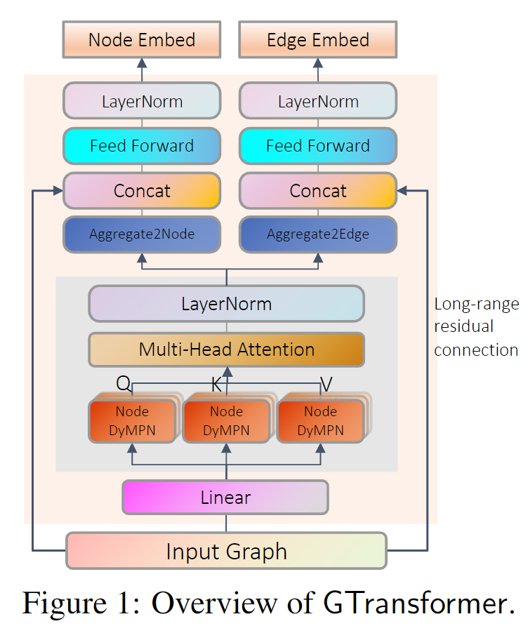
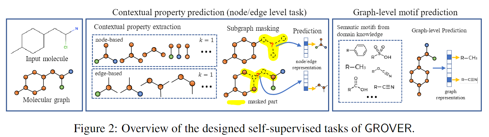
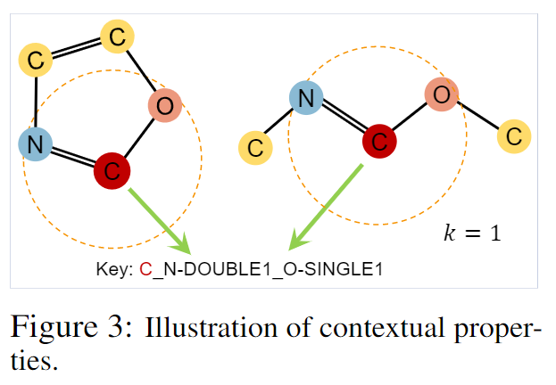

# **Self-Supervised Graph Transformer on Large-Scale Molecular Data**

## Relevant Resources：

paper：https://papers.nips.cc/paper/2020/file/94aef38441efa3380a3bed3faf1f9d5d-Paper.pdf

code：  https://github.com/tencent-ailab/grover

这篇文章发表于NIPS 2020，提出了一种借鉴**Transformer**的图神经网络，且涉及了两个自监督任务来预训练模型。整个模型称为**GROVER**

## Motivation：

Despite the fruitful progress, two issues still impede the usage of deep learning in real scenarios:
**(1) insufficient labeled data for molecular tasks; **

**(2) poor generalization capability of models in the enormous chemical space.** 

Different from other domains (such as image classification) that have rich-source labeled data, getting labels of molecular property requires wet-lab experiments which is time-consuming and resource-costly. As a consequence, most public molecular benchmarks contain far-from-adequate labels. Conducting deep learning on these benchmarks is prone to over-fitting and
the learned model can hardly cope with the out-of-distribution molecules.

两个问题阻碍了GNNs在实际场景中的使用：

1. 带标签的分子数较少，远远不够用于监督学习；
2. 没有很好的泛化性，不能泛化到其他新合成分子的学习上。

## Contribution:

为了解决任务背景中提到的问题，该论文提出了一个新的框架——GROVER（Graph Representation FrOm self-superVised mEssage passing tRansformer）。该框架实现了如下的贡献：
（1）通过精心设计的节点级、边级和图级的自监督任务，GROVER可以从大量未标记的分子数据中学习到丰富的分子结构和语义信息。
（2）为了编码如此复杂的信息， GROVER将GNNs中的消息传递网络（Message Passing Networks，MPS）集成到Transformer的架构中，以提供更具表现力的分子编码器。
（3）GROVER能够在无标签的大规模分子数据集上有效地训练，而不需要任何监督的，从而解决有标签数据少和泛化性差两个问题。
（4）在1000万个未标记分子上，用1亿个参数去预训练GROVER ，这是目前为止分子表征学习中最大的GNN和最大的训练数据集。
（5）利用预训练的GROVER进行分子性质预测，然后进行特定任务的微调，在11个具有挑战性的基准上，与当前最先进的方法相比GROVER有了巨大的改进(平均超过6%)。
（6）精心设计的自监督Loss和大规模无监督的预训练模型在提高性能方面具有巨大的潜力。

## Model:

**1、要点一**
上图是GROVER的主要模型框架，这个模型总体来说是对经典的Transformer模型进行修改：（1）输入由序列变成图；（2）引入了dyMPN（解释见下）提取图的结构信息；（3）将每一层的encoder的残差连接变成了长距离残差连接（long-range residual connection），也就是直接从第一层到最后一层。

**2、要点二**
该论文将GROVER的预训练框架分为如下两个阶段，这种双层信息提取策略极大地增强了GROVER的表示能力：
（1）消息传递过程捕获图的局部结构信息，因此使用GNN模型的输出作为query、key和value将得到所涉及的局部子图结构，从而构成信息提取的第一级。
（2）Transformer的encoder可以被视为一个完全连通图上的GAT（图注意力网络）的变体，使用它对第一级信息进一步提取，得到全局节点的关联关系，这构成信息抽取的第二级。

**3、要点三**
$$
m^{(l,k)}_v=AGGREGATE^{L}(\{h_v^{(l,k-1)},h_u^{(l,k-1)},e_{uv}|u∈N_v\}),
\\
h_v^{l,k}=\sigma(W^{l}m_b^{l,k}+b^{(l)})
$$
一般的消息传递过程, 有两个超参数:迭代次数$L$和跳数$K_l,l=1,...,L$。跳数与图卷积运算的感受野大小密切相关，会影响消息传递模型的泛化能力。

给定固定的层数$L$，预先指定的跳数可能不适用于不同类型的数据集。于是该论文开发一种随机策略，代替预先指定的$K_l$，用于在训练过程中选择消息传递跳数：在每个epoch，从$l$层的一些随机分布中选择$K_l$。该论文将这种随机策略的消息传递网络称为动态消息传递网络（**Dynamic Message Passing Network, dyMPN**)。
该论文发现随机化的两种选择效果很好：
（1）**均匀分布**
$$
K_l\sim U(a,b)
$$
（2）**截断标准正态分布(带界的正态分布)**
$$
\phi(\mu,\sigma,a,b)
$$
dyMPN使得图卷积运算中的每个节点都具有随机感受野。大量的实验验证表明，dyMPN比没有随机化策略的普通MPN具有更好的泛化性能。

## Self-supervised Task

作者认为，一个好的自监督任务需要具备两个条件：1）预测目标是可靠的，且容易获得；2）预测目标需要反应节点/边的内容信息。

**Contextual Property Prediction.**

这里论文定义了一个统计属性，该属性的计算如下：1）给定一个目标节点，提取它的局部k-hop的邻居节点和边。2）提取该局部图的统计属性，也就是node-edge-counts，比如下图，目标节点是C（碳原子），如果k=1，也就是一阶邻域，那么将会采样到N和O，最后得到该局部图的该统计属性为C_N-DOUBLE1_O-SINGLE1。

给定一个分子图，将其输入GROVER的编码器后，我们获取了它的每个节点和边的嵌入表示，假设节点$v$的嵌入表示为$h_v$，可以用这个嵌入输入一个前馈网络，来得到节点$v$的Contextual Property的预测值。
**Graph-level Motif Prediction.**

图级自监督任务也需要可靠廉价的标签。**模体（motif）**是输入图数据中的循环子图，在分子图数据中普遍存在。分子中一类重要的模体是**功能团（functional groups）**，它编码分子丰富的领域知识，可以很容易地被专业软件检测到，如RDKit。
模体预测任务可以表述为一个多标签分类问题，其中每个模体对应一个标签。对于一个特定的分子（抽象为图G），使用RDKit检测每个模体是否出现在图G中，然后将它们用作模体预测任务的目标。
